include::_settings.adoc[]
:speaker: Krzysztof Sobkowiak (http://twitter.com/ksobkowiak[@ksobkowiak])
:speaker-title: The Apache Software Foundation Member, Senior Solution Architect at Capgemini
:speaker-email: krzysztof.sobkowiak@capgemini.com
:speaker-blog: http://krzysztof-sobkowiak.net
:speaker-twitter: http://twitter.com/ksobkowiak[@ksobkowiak]

// -------------------------------------------------------------------------------
= Capgemini Immediate Digital Framework

[.cover]
--
+++<h3>Introduction</h3>+++
[.newline]

[.event]
IT Architecture Community +
Wrocław, 20 June 2016

[.newline]
{speaker}
[.speaker-title]
The Apache Software Foundation Member +
Senior Solution Architect at Capgemini
//[.logo-left]
//image:{template-images-dir}/feather.png[width="60", link="http://apache.org"]
--

// -------------------------------------------------------------------------------
== About Me

[.noredheader,cols="75%,25%"]
|===
a|
* FOSS enthusiast, evangelist & architect
* The Apache Software Foundation
** Member
** Apache ServiceMix commiter & PMC chair (V.P. Apache ServiceMix)
** active at Apache Karaf, CXF, Camel, ActiveMQ
* Member/developer at http://oasp.io[OASP], https://ops4j1.jira.com/wiki/[OPS4J]
* Senior Solution Architect & trainer at Capgemini
* Co-founder, member & trainer at http://robocap.pl[RoboCap.pl]
<.^| image:{template-images-dir}/kso1.png[] |
|===

// -------------------------------------------------------------------------------

=== !

[.centering]
--
image:{template-images-dir}/warn.png[]

[.medium-text]
Views in this presentation are my personal views and do not necessarily reflect the views of Capgemini.
--

// -------------------------------------------------------------------------------

// -------------------------------------------------------------------------------
== Immediate
[.centering]
--
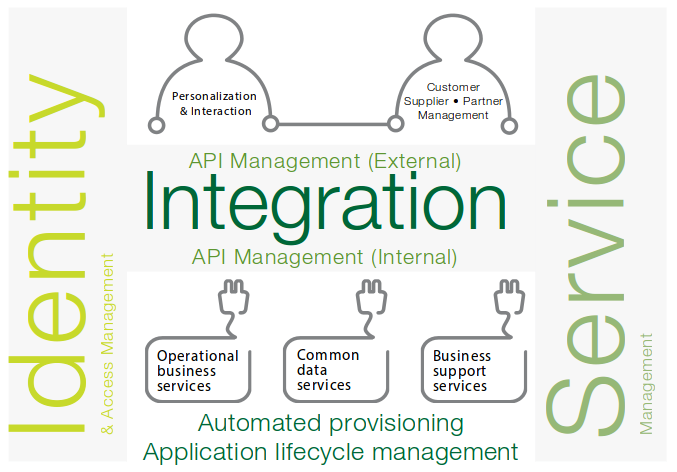
--

// -------------------------------------------------------------------------------
=== Immediate

* Immediate is a robust and secure _digital platform_ for application development
and integration using open source and SaaS.
* It helps you integrate new _digital services_ quickly, consistently and cost-
effectively, on-premise or in the cloud.
* Its purpose is to allow you to quickly leverage the market innovations of your
choice in order to achieve growth and stay two steps ahead of the competition.
* It helps you innovate by integrating the best digital services into your business.
* The platform can be consumed in part, or as an end-to-end service operated and
managed by Capgemini.

// -------------------------------------------------------------------------------
=== Immediate

[.noredheader,cols="55%,45%"]
|===
.^a|
* Immediate gives you a digital platform to:
** Create a seamless customer experience
** Develop mobile apps
** Orchestrate services
** Manage access, identity and security
** Derive insights from your data
** Support a shift to a DevOps-based culture and approach
* Immediate is complete, enterprise-scale, proven and ready-to-go.
^.^| 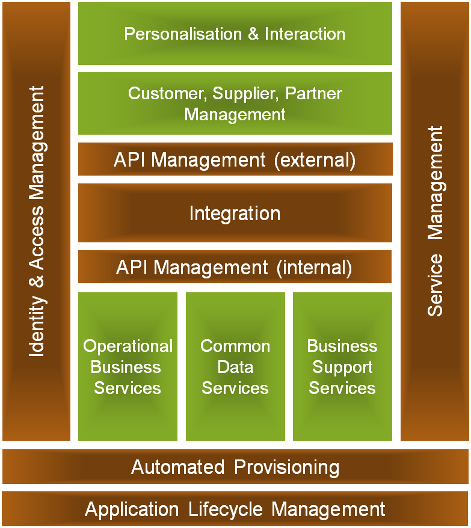 |
|===

// -------------------------------------------------------------------------------
=== Immediate Accelerators

[.noredheader,cols="55%,45%"]
|===
.^a|
* Immediate consists of a reference architecture and six pre-built accelerators:
** Integration
** API Management
** Identity & Access Management
** Service Management
** Automated Provisioning
** Application Lifecycle Management.
^.^|  |
|===

// -------------------------------------------------------------------------------
=== Immediate Accelerators

[.noredheader,cols="55%,45%"]
|===
.^a|
* Based on mature open-source products.
* Contain
** extensive documentation,
** scalable examples
** and auto-provisioning scripts.
* Products are unchanged by Capgemini and are supported and maintained by the originating source
^.^| 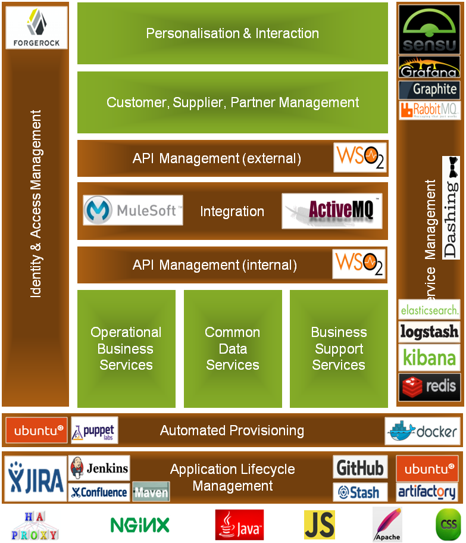 |
|===

// -------------------------------------------------------------------------------
=== Immediate Technologies

[.noredheader,cols="55%,45%"]
|===
.^a|
.The products selected with these key principles in mind:
* Functionally rich
* Mature open source
* Cost-effective support mode
* IaaS neutral
* Scalable and cheap to deploy so they can
    be used for proofs of concepts, alphas,
    prototypes all the way to super secure high
    volume systems
* Deployable on public or private cloud
^.^|  |
|===

// -------------------------------------------------------------------------------
== API Management Accelerator

// -------------------------------------------------------------------------------
=== What our customers need?

* Meet Partner demand for increased collaboration
* Offer existing services externally
* Simple, lightweight APIs to support a Mobile strategy
* Deliver APIs to 24x7x365 service levels
* Self Service API Discovery
* Analytical information on API use
* Support for API lifecycle
* Policy driven approach to security, rate limiting, billing

// -------------------------------------------------------------------------------
=== Concepts

[.centering]
--
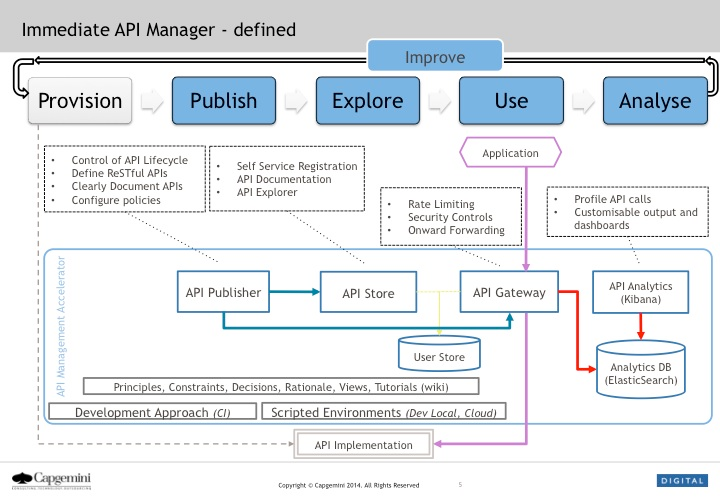
--

// -------------------------------------------------------------------------------
=== Architecture --  Logical View

[.centering]
--
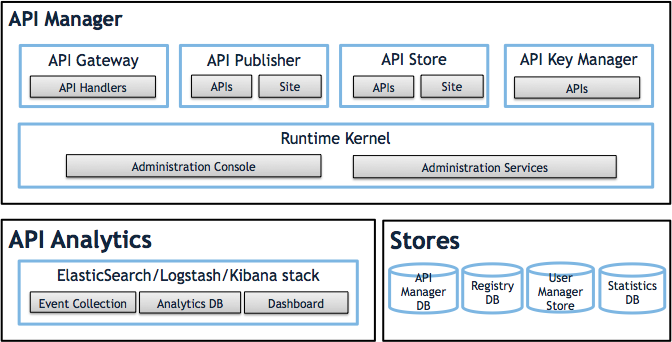
--

// -------------------------------------------------------------------------------
=== Architecture --  Process View

[.centering]
--
image:images/api-management-acc-process-view.png[width="70%"]
--

// -------------------------------------------------------------------------------
=== Features

* Self-service registration
* API Documentation & Design
* Rate limits
* Support for API Consumer development lifecycle
* Scripted API Configuration
* API Analytics
* Automated Provisioning

// -------------------------------------------------------------------------------
=== Supporting Software

[.noredheader,cols="55%,45%"]
|===
^.^a|
* WSO2 Carbon
* WSO2 API Manager
* WSO2 Governance Registry
* Elasticsearch ELK
* Swagger
* Puppet
^.^a|
* VirtualBox
* Vagrant
* MariaDB
* HAProxy
* DNSMasq
* Consul Agent
 |
|===

// -------------------------------------------------------------------------------
== Integration Accelerator

// -------------------------------------------------------------------------------
=== What our customers need?

* Avoid point to point?
* Create a pluggable architecture where you can swap in and out SaaS Services avoiding lock-in?
* Manage and analyse data when it is everywhere?
* Create reliable systems from unreliable SaaS services?
* Deploy solutions across PaaS and IaaS providers, avoiding IaaS lock-in?
* Assurance of the customer experiences they are going to get before we have started to deliver it?
* Create solutions that scale both technically and commercially?
* Ensure that our solutions are engineered consistently and to a high quality?
* Deliver rapidly so that our customers can take advantage of new opportunities / technology?

// -------------------------------------------------------------------------------
=== Concepts

[.centering]
--
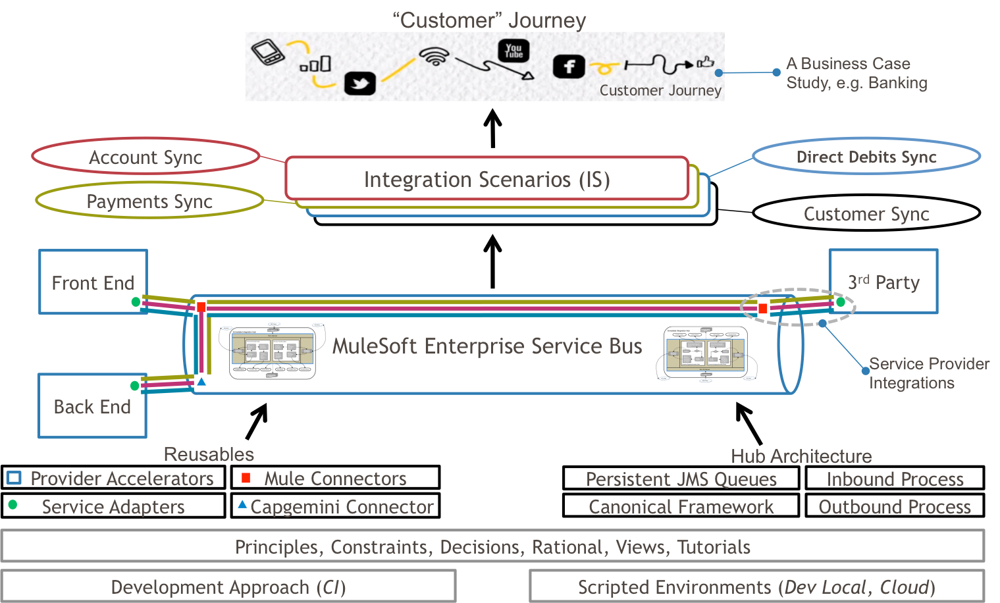
--

// -------------------------------------------------------------------------------
=== Architecture --  Logical View

[.centering]
--
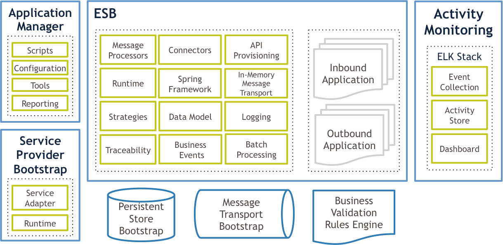
--

// -------------------------------------------------------------------------------
=== Architecture --  Process View

[.centering]
--
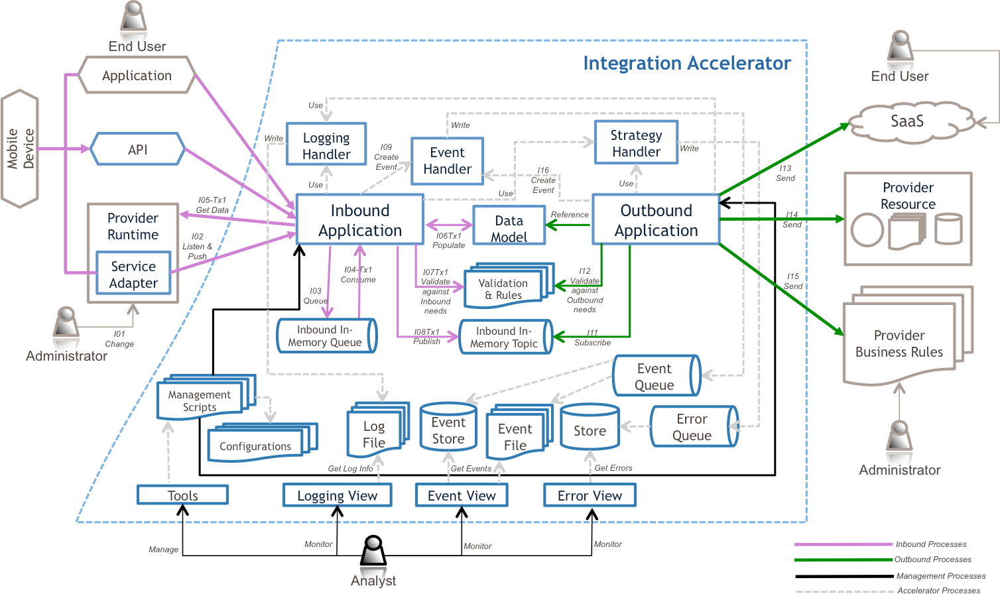
--

// -------------------------------------------------------------------------------
=== Features

[.noredheader,cols="55%,45%"]
|===
.^a|
* Connectors
* Management
* Monitoring
* Logging
* Incident Reporting
* Events
* Service Provider Integrations
* Service Adapters
.^a|
* Data Integration
* API Provisioning
* On-premises
* Patterns
* Strategies
* Message Processing
* Batch Processing
* Mule Integration Best Practices
 |
|===

// -------------------------------------------------------------------------------
=== Supporting Software

[.noredheader,cols="55%,45%"]
|===
^.^a|
* Mule ESB
* Anypoint™ Studio
* Elasticsearch ELK
* Puppet
* Apache™ ActiveMQ
^.^a|
* VirtualBox
* Vagrant
* HAProxy
* DNSMasq
* Consul Agent
 |
|===

// -------------------------------------------------------------------------------
== IAM Accelerator

// -------------------------------------------------------------------------------
=== What our customers need?

* Provide seamless Security across on-premise and SaaS services
* Provide contextual security e.g. allow a user to log on to SaaS in different ways depending on whether they are on the internal network or not
* Federated Login to services using common Internet-based logins e.g. Facebook
* Login services for 10m+ external users (vs 10k+ for internal)
* SSO across multiple types of applications
* Support authentication of APIs
* Adaptability - respond to change quickly
* Policy driven approach rather than code
* Support mobile
* Central administration of accounts

// -------------------------------------------------------------------------------
=== Security within the IAM Accelerator

[.centering]
--
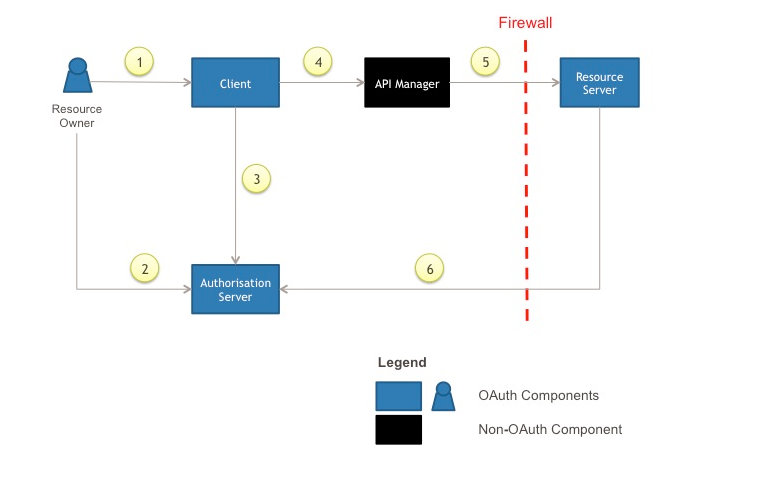
--

// -------------------------------------------------------------------------------
=== Architecture --  Logical View

[.centering]
--
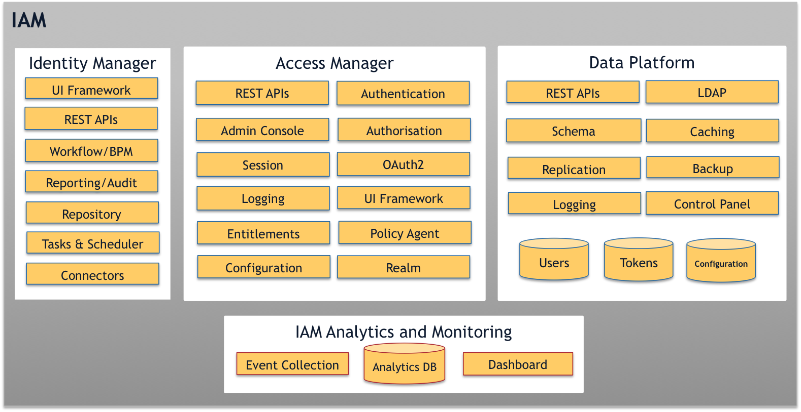
--

// -------------------------------------------------------------------------------
=== IAM Self-Registration/Password Management Process View

[.centering]
--
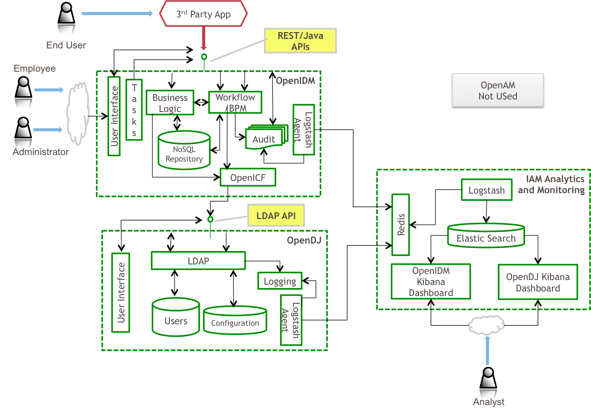
--

// -------------------------------------------------------------------------------
=== IAM Authentication and Authorisation Process View

[.centering]
--
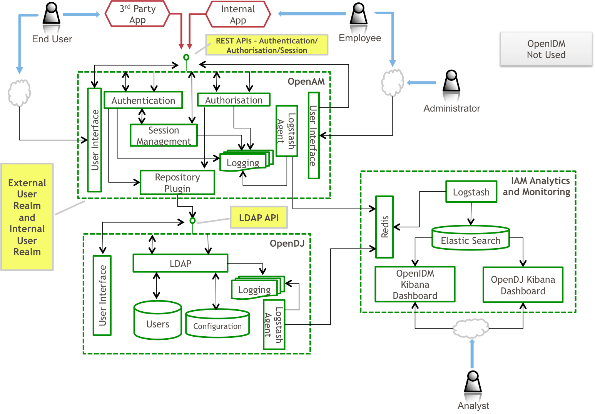
--

// -------------------------------------------------------------------------------
=== Features

[.noredheader,cols="55%,45%"]
|===
.^a|
* Configuring an OAuth2 Provider
* Configuring External OAuth2 Providers
* Configuring Multi-factor Authentication
* Creating Custom User Attributes
* User Consent Design
* User Consent Implementation Guide
.^a|
* Accessing Protected Resources
* Rebranding OpenAM End User Pages
* Rebranding OpenIDM Registration Pages
* Synchronising OpenIDM with OpenDJ
* Integrating OpenIDM with ELK
* Automated Provisioning
 |
|===

// -------------------------------------------------------------------------------
=== Supporting Software
[.noredheader,cols="55%,45%"]
|===
^.^a|
* OpenAM
* OpenDJ
* OpenIDM
* Elasticsearch ELK
* Puppet
^.^a|
* VirtualBox
* Vagrant
* HAProxy
* DNSMasq
* Consul Agent
 |
|===

// -------------------------------------------------------------------------------
== Service Management Accelerator

// -------------------------------------------------------------------------------
=== What our customers need?

* Proactive, not reactive - fix problems before users are impacted
* convergence of technical and business monitoring
* release regularly with no downtime
* manage an estate that changes shape/size dynamically (elastic capacity)
* ability to understand state of digital and non-digital components

// -------------------------------------------------------------------------------
=== Architecture --  Logical View

[.centering]
--
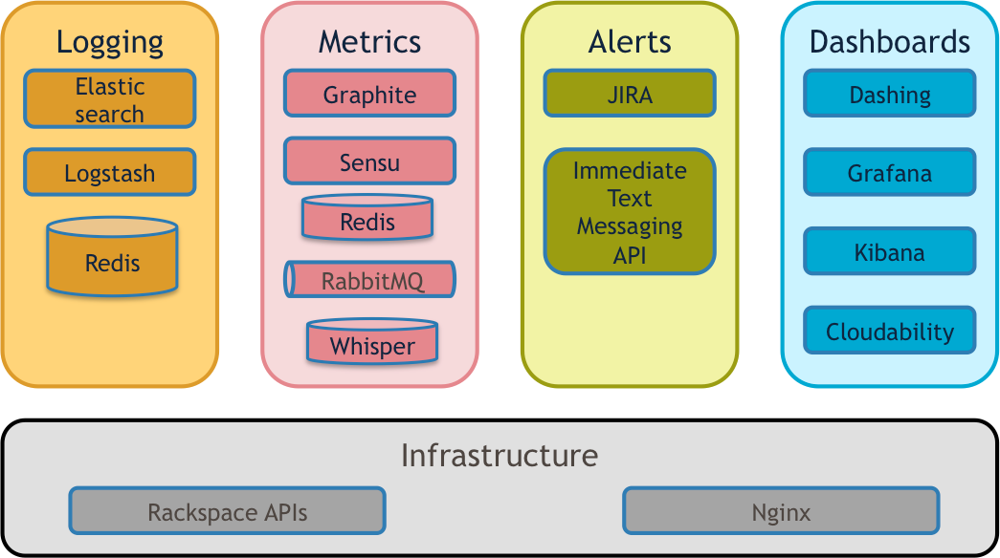
--

// -------------------------------------------------------------------------------
=== Architecture -- Process View

[.centering]
--
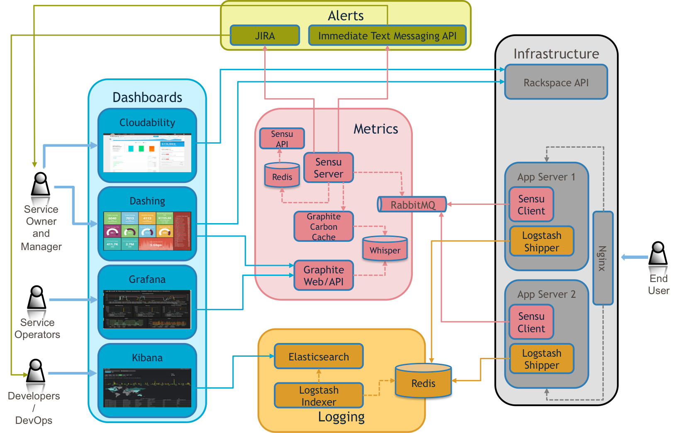
--

// -------------------------------------------------------------------------------
=== Supporting Software
[.noredheader,cols="55%,45%"]
|===
^.^a|
* Sensu
* Graphite
* Dashing
* Grafana
* RabbitMQ
* Redis
* Elasticsearch ELK
^.^a|
* Puppet
* VirtualBox
* Vagrant
* HAProxy
* DNSMasq
* Consul Agent
 |
|===

// -------------------------------------------------------------------------------

// -------------------------------------------------------------------------------

// -------------------------------------------------------------------------------

// -------------------------------------------------------------------------------

// -------------------------------------------------------------------------------

// -------------------------------------------------------------------------------

// -------------------------------------------------------------------------------

// -------------------------------------------------------------------------------

// -------------------------------------------------------------------------------

// -------------------------------------------------------------------------------

== !

[.thanks]
--
image:{template-images-dir}/smile.png[]

+++<h1>Thanks!</h1>+++
[.underline]
image:{template-images-dir}/underline.png[]

[.large-text]
Any questions?

[.newline]
You can find me at +
{speaker-twitter} +
{speaker-email} +
{speaker-blog}
--

// -------------------------------------------------------------------------------

=== !

[.centering]
--
image:{template-images-dir}/warn.png[]

[.small-text]
+++
 This work is licensed under a <a rel="license" href="http://creativecommons.org/licenses/by-sa/4.0/">Creative Commons Attribution-ShareAlike 4.0 International License</a>.
+++

[.small-text]
--

// -------------------------------------------------------------------------------
