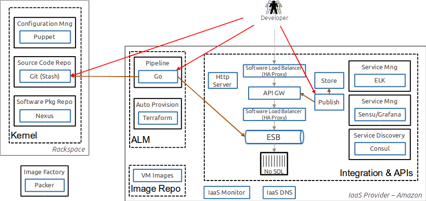

include::_settings.adoc[]
//:speaker: Krzysztof Sobkowiak (http://twitter.com/ksobkowiak[@ksobkowiak])
:speaker: Krzysztof Sobkowiak
:speaker-title: The Apache Software Foundation Member, Senior Solution Architect at Capgemini
:speaker-email: krzysztof.sobkowiak@capgemini.com
:speaker-blog: http://krzysztof-sobkowiak.net
:speaker-twitter: http://twitter.com/ksobkowiak[@ksobkowiak]

// -------------------------------------------------------------------------------
= Immediate in Action

[.cover]
--
//+++<h3>Introduction</h3>+++
[.newline]

[.event]
IT Architecture Community +
Wrocław, 28 July 2016

[.newline]
[.noredheader,cols="26%,24%,24%,26%"]
|===
^.^a|
^.<a|
Tomasz Lewandowski
//[.speaker-title]
//Senior Solution Architect
^.<a|
{speaker}
//[.speaker-title]
//Senior Solution Architect +
//The ASF Member
^.^a| |
2+^.| Wes Miles (Demo Video) |
|===

//{speaker}
//[.speaker-title]
//The Apache Software Foundation Member +
//Senior Solution Architect at Capgemini
//[.logo-left]
//image:{template-images-dir}/feather.png[width="60", link="http://apache.org"]
--

// -------------------------------------------------------------------------------
//include::slides/about.adoc[]
// -------------------------------------------------------------------------------
//include::slides/disclaimer.adoc[]
// -------------------------------------------------------------------------------

== Outline

* Immediate -- What is it?
* Accelerators -- Overview
* Immediate in Action -- AWS Demo
* Deep Dive into selected Accelerators

// -------------------------------------------------------------------------------
== Capgemini Immediate Digital Framework

image::images/immediate.png[width="30%", align="center"]

// -------------------------------------------------------------------------------
=== Immediate

* Immediate is a robust and secure _digital platform_ for application development
and integration using open source and SaaS.
* It helps you integrate new _digital services_ quickly, consistently and cost-
effectively, on-premise or in the cloud.
* Its purpose is to allow you to quickly leverage the market innovations of your
choice in order to achieve growth and stay two steps ahead of the competition.
* It helps you innovate by integrating the best digital services into your business.
* The platform can be consumed in part, or as an end-to-end service operated and
managed by Capgemini.

// -------------------------------------------------------------------------------
=== Immediate

[.noredheader,cols="55%,45%"]
|===
.^a|
* Immediate gives you a digital platform to:
** Create a seamless customer experience
** Develop/integrate mobile apps
** Orchestrate services
** Manage access, identity and security
** Derive insights from your data
** Support a shift to a DevOps-based culture and approach
* Immediate is complete, enterprise-scale, proven and ready-to-go.
^.^|  |
|===

// -------------------------------------------------------------------------------
=== Immediate

[.noredheader,cols="55%,45%"]
|===
.^a|
* The platform makes it easy for you to:
** Test and learn through proofs of concept
** Scale new services for the enterprise
** Plug and play new services without labour-intensive integration
** Be agile without losing control
^.^|  |
|===

// -------------------------------------------------------------------------------
=== Immediate Accelerators

[.noredheader,cols="55%,45%"]
|===
.^a|
* Immediate consists of a reference architecture and six pre-built accelerators:
** Integration
** API Management
** Identity & Access Management
** Service Management
** Automated Provisioning
** Application Lifecycle Management.
^.^|  |
|===

// -------------------------------------------------------------------------------
=== Immediate Accelerators

[.noredheader,cols="55%,45%"]
|===
.^a|
* Based on mature open-source products.
* Contain
** extensive documentation,
** scalable examples
** and auto-provisioning scripts.
* Products are unchanged by Capgemini and are supported and maintained by the originating source
^.^|  |
|===

// -------------------------------------------------------------------------------
=== Immediate Technologies

[.noredheader,cols="55%,45%"]
|===
.^a|
.The products selected with these key principles in mind:
* Functionally rich
* Mature open source
* Cost-effective support mode
* Scalable and cheap to deploy so they can
    be used for proofs of concepts, alphas,
    prototypes all the way to super secure high
    volume systems
* IaaS neutral
* Deployable on public or private cloud
^.^|  |
|===

// -------------------------------------------------------------------------------
== API Management Accelerator

// -------------------------------------------------------------------------------
=== What our customers need?

* Meet Partner demand for increased collaboration
* Offer existing services externally
* Simple, lightweight APIs to support a Mobile strategy
* Deliver APIs to 24x7x365 service levels
* Self Service API Discovery
* Analytical information on API use
* Support for API lifecycle
* Policy driven approach to security, rate limiting, billing

// -------------------------------------------------------------------------------
=== Concepts

// -------------------------------------------------------------------------------
=== Architecture --  Logical View

// -------------------------------------------------------------------------------
=== Architecture --  Process View

image::images/api-management-acc-process-view.png[width="70%", align="center"]

// -------------------------------------------------------------------------------
=== Features

* Self-service registration
* API Documentation & Design
* Rate limits
* Support for API Consumer development lifecycle
* Scripted API Configuration
* API Analytics
* Automated Provisioning

// -------------------------------------------------------------------------------
=== Supporting Software

[.noredheader,cols="55%,45%"]
|===
^.^a|
* WSO2 Carbon
* WSO2 API Manager
* WSO2 Governance Registry
* Elasticsearch ELK
* Swagger
* Puppet
^.^a|
* VirtualBox
* Vagrant
* MariaDB
* HAProxy
* DNSMasq
* Consul Agent
 |
|===

// -------------------------------------------------------------------------------
== Integration Accelerator

// -------------------------------------------------------------------------------
=== What our customers need?

* Avoid point to point
* Create a pluggable architecture where you can swap in and out SaaS Services avoiding lock-in
* Manage and analyse data when it is everywhere
* Create reliable systems from unreliable SaaS services
* Deploy solutions across PaaS and IaaS providers, avoiding IaaS lock-in
* Assurance of the customer experiences they are going to get before we have started to deliver it
* Create solutions that scale both technically and commercially
* Ensure that our solutions are engineered consistently and to a high quality
* Deliver rapidly so that our customers can take advantage of new opportunities / technology

// -------------------------------------------------------------------------------
=== Concepts

image::images/integration-acc-concepts.png[width="70%", align="center"]

// -------------------------------------------------------------------------------
=== Architecture --  Logical View

image::images/integration-acc-logical-view.png[width="70%", align="center"]

// -------------------------------------------------------------------------------
=== Architecture --  Process View

// -------------------------------------------------------------------------------
=== Features

[.noredheader,cols="55%,45%"]
|===
.^a|
* Connectors
* Management
* Monitoring
* Logging
* Incident Reporting
* Events
* Service Provider Integrations
* Service Adapters
.^a|
* Data Integration
* API Provisioning
* On-premises
* Patterns
* Strategies
* Message Processing
* Batch Processing
* Mule Integration Best Practices
 |
|===

// -------------------------------------------------------------------------------
=== Supporting Software

[.noredheader,cols="55%,45%"]
|===
^.^a|
* Mule ESB
* Anypoint™ Studio
* Elasticsearch ELK
* Puppet
* Apache™ ActiveMQ
* RabbitMQ
^.^a|
* VirtualBox
* Vagrant
* HAProxy
* DNSMasq
* Consul Agent
 |
|===

// -------------------------------------------------------------------------------
== IAM Accelerator

// -------------------------------------------------------------------------------
=== What our customers need?

* Provide seamless Security across on-premise and SaaS services
* Provide contextual security e.g. allow a user to log on to SaaS in different ways depending on whether they are on the internal network or not
* Federated Login to services using common Internet-based logins e.g. Facebook
* Login services for 10m+ external users (vs 10k+ for internal)
* SSO across multiple types of applications
* Support authentication of APIs
* Adaptability - respond to change quickly
* Policy driven approach rather than code
* Support mobile
* Central administration of accounts

// -------------------------------------------------------------------------------
=== Architecture --  Logical View

// -------------------------------------------------------------------------------
=== IAM Self-Registration/Password Management Process View

image::images/iam-acc-process-view-1.png[width="60%", align="center"]

// -------------------------------------------------------------------------------
=== IAM Authentication and Authorisation Process View

image::images/iam-acc-process-view-2.png[width="60%", align="center"]

// -------------------------------------------------------------------------------
=== Security within the IAM Accelerator

image::images/iam-acc-concepts.png[width="60%", align="center"]

// -------------------------------------------------------------------------------
=== Features

[.noredheader,cols="55%,45%"]
|===
.^a|
* Configuring an OAuth2 Provider
* Configuring External OAuth2 Providers
* Configuring Multi-factor Authentication
* Creating Custom User Attributes
* User Consent Design
* User Consent Implementation Guide
.^a|
* Accessing Protected Resources
* Rebranding OpenAM End User Pages
* Rebranding OpenIDM Registration Pages
* Synchronising OpenIDM with OpenDJ
* Integrating OpenIDM with ELK
* Automated Provisioning
 |
|===

// -------------------------------------------------------------------------------
=== Supporting Software
[.noredheader,cols="55%,45%"]
|===
^.^a|
* OpenAM
* OpenDJ
* OpenIDM
* Elasticsearch ELK
* Puppet
^.^a|
* VirtualBox
* Vagrant
* HAProxy
* DNSMasq
* Consul Agent
 |
|===

// -------------------------------------------------------------------------------
== Service Management Accelerator

// -------------------------------------------------------------------------------
=== What our customers need?

* Proactive, not reactive - fix problems before users are impacted
* convergence of technical and business monitoring
* release regularly with no downtime
* manage an estate that changes shape/size dynamically (elastic capacity)
* ability to understand state of digital and non-digital components

// -------------------------------------------------------------------------------
=== Architecture --  Logical View

image::images/service-management-acc-logical-view.png[width="70%", align="center"]

// -------------------------------------------------------------------------------
=== Architecture -- Process View

image::images/service-management-acc-process-view.png[width="70%", align="center"]

// -------------------------------------------------------------------------------
=== Supporting Software
[.noredheader,cols="55%,45%"]
|===
^.^a|
* Sensu
* Graphite
* Dashing
* Grafana
* RabbitMQ
* Redis
* Elasticsearch ELK
^.^a|
* Puppet
* VirtualBox
* Vagrant
* HAProxy
* DNSMasq
* Consul Agent
 |
|===

// -------------------------------------------------------------------------------
== Automated Provisioning Accelerator

// -------------------------------------------------------------------------------
=== What our customers need?

* Release new features into Production regularly, ideally on a daily or weekly basis.
* Automate the creation and update of environments including infrastructure, platforms and applications.
* Make infrastructure changes at the same pace as agile application development.
* Make platform changes at the same pace as agile application development.
* Provision new environments rapidly to meet the needs of parallel application development.
* Provision new environments rapidly to meet the needs of partner/third party integration projects.
* Have confidence and the ability to re-provision whole environments when necessary.

// -------------------------------------------------------------------------------
=== Concepts

// -------------------------------------------------------------------------------
=== Architecture --  Logical View

// -------------------------------------------------------------------------------
=== Architecture -- Process View

// -------------------------------------------------------------------------------
=== Supporting Software
[.noredheader,cols="55%,45%"]
|===
^.^a|
* VirtualBox
* VirtualBox
* Puppet
* Terraform
^.^a|
* Packer
* Consul Agent
* Consul Template
* OpenVPN
 |
|===

// -------------------------------------------------------------------------------
== ALM Accelerator

// -------------------------------------------------------------------------------
=== What our customers need?

* Continuous delivery of new features into production on a regular basis through a controlled and audited process.
* Ability to understand exactly what software is deployed to each server in your environment.
* Governance of multiple suppliers delivering services in co-located or distributed teams.
* Project and agile team reporting including dashboards, burn-down charts and velocity graphs.
* Project and task management functions including bug tracking and issue tracking.
* Continuous integration tooling to ensure a solution’s components are integrated early and continuously leading to more stable higher quality solutions.
* Configuration management tooling to provide source code, artefact and release management functions.
* Collaboration tools to enable clients and suppliers to work together in co-located or distributed teams; e.g. wikis, forums, video, etc.
* Requirements management including product and sprint backlog tooling.

// -------------------------------------------------------------------------------
=== Architecture --  Logical View

// -------------------------------------------------------------------------------
=== Architecture -- Process View

// -------------------------------------------------------------------------------
=== Supporting Software
[.noredheader,cols="55%,45%"]
|===
^.^a|
* GoCD
* Nexus
* VirtualBox
* Vagrant
* Puppet
^.^a|
* Atlassian JIRA
* Atlassian Confluence
* Atlassian Bitbucket
* Atlassian Crowd
 |
|===

// -------------------------------------------------------------------------------

// -------------------------------------------------------------------------------

// -------------------------------------------------------------------------------

// -------------------------------------------------------------------------------

// -------------------------------------------------------------------------------

// -------------------------------------------------------------------------------

// -------------------------------------------------------------------------------

== Immediate in Action - AWS Demo

// -------------------------------------------------------------------------------

=== Immediate in Action - AWS Demo

* See the real-time auto provisioning of the Immediate Platform onto Amazon, based on the principle of "infrastructure as code”
* See the deployment of a single page application and API onto the platform demonstrating Application Lifecycle Management and continuous delivery
* See the operational monitoring capabilities that enable a proactive not reactive approach to service management.

=== The Scenario -- Provision the Platform

// -------------------------------------------------------------------------------

=== The Scenario -- Deliver an API

// -------------------------------------------------------------------------------

=== The Scenario -- Deliver an Application

// -------------------------------------------------------------------------------

== Deep Dive into selected Accelerators

// -------------------------------------------------------------------------------

// -------------------------------------------------------------------------------
include::slides/qa.adoc[]
// -------------------------------------------------------------------------------
//include::slides/license.adoc[]
// -------------------------------------------------------------------------------
